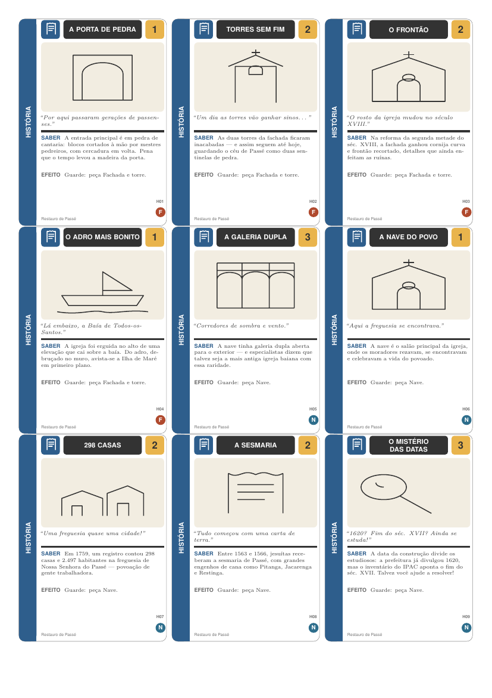
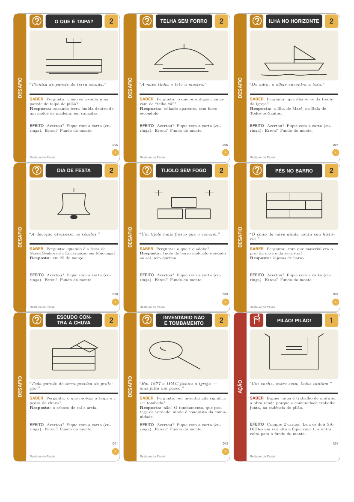

# Restauro de Passé ♦

[](https://github.com/Colombiano/restauro-de-passe/actions/workflows/build.yml)
[](https://github.com/Colombiano/restauro-de-passe/releases)
[](LICENSE)
[](LICENSE)
[](https://www.latex-project.org/)
[](CONTRIBUTING.md)

**O jogo de cartas da Igreja de Nossa Senhora da Encarnação de Passé** — distrito de Passé, Candeias, Bahia, Brasil.

Um baralho educativo, de código aberto e escrito em **LaTeX/TikZ**, para crianças e jovens de **6 a 14 anos** conhecerem a ruína histórica da igrejinha de Passé e as **técnicas construtivas** do Recôncavo Baiano — taipa de pilão, adobe, pedra e cal, telha colonial — que ainda podem inspirar as construções atuais do povoado.

| Cartas de História | Cartas de Desafio |
| :---: | :---: |
|  |  |

---

## Baixe e jogue (sem precisar instalar nada)

1. Vá em [**Releases**](../../releases) e baixe os arquivos `cartas.pdf` e `regras.pdf` já prontos.
2. Imprima `cartas.pdf` **em papel A4, escala 100 %** (desmarque “ajustar à página”), **frente e verso** (a última metade do arquivo é o verso das cartas — configure “imprimir páginas ímpares, virar pela borda longa”).
3. Recorte pelas bordas (cartas de 63 × 88 mm) e arredonde os cantos se quiser.
4. Leia `regras.pdf` e divirta-se reconstruindo a igreja!

> **Não tem impressora?** Jogue lendo as cartas na tela mesmo, projetadas em sala de aula. O manual traz variações para esse uso.

## Quer compilar você mesmo?

O passo a passo completo para **Windows (MiKTeX)** e **macOS (MacTeX)** — com
instalação, geração dos PDFs e impressão — está em
[docs/INSTALAR.md](docs/INSTALAR.md). Se você já tem uma distribuição LaTeX com
TikZ, o resumo é:

```bash
cd cartas && pdflatex cartas.tex && pdflatex cartas.tex   # 2x para os versos
cd ../regras && pdflatex regras.tex && pdflatex regras.tex
```

Ou use o script (Linux/macOS): `./ferramentas/compilar.sh`

## Como se joga (resumo)

- **2 a 6 jogadores**, 6–14 anos, ~20–40 min.
- Cada carta tem um **SABER** (fato real sobre a igreja ou sobre uma técnica) que se lê em voz alta.
- Quatro naipes: **HISTÓRIA** (azul), **CONSTRUÇÃO** (verde), **DESAFIO** (laranja, perguntas com resposta) e **AÇÃO** (vermelha).
- Cada carta de HISTÓRIA/CONSTRUÇÃO pertence a uma **peça da igreja**: Fachada e torre, Nave, Capela-mor, Paredes ou Telhado. Vence quem reunir as **cinco peças**; as cartas DESAFIO são curingas.
- Há modo cooperativo, adaptações por faixa etária e **oficinas práticas** (minitaipa, caça-técnica no bairro, desenho arquitetônico) para levar as técnicas da igreja para a vida real.

O manual completo está em [`regras/regras.tex`](regras/regras.tex) (fonte) e no PDF compilado.

## Estrutura do projeto

```
├── cartas/                  # O baralho (LaTeX/TikZ)
│   ├── cartas.tex           # As 54 cartas + versos (PDF de 12 páginas)
│   └── preambulo_cartas.tex # Motor visual das cartas (estilo, pictogramas)
├── regras/regras.tex        # Manual de regras ilustrado
├── docs/
│   ├── INSTALAR.md          # Guia passo a passo para Windows e macOS
│   ├── HISTORIA.md          # Dossiê do monumento com fontes verificadas
│   ├── METODOLOGIA.md       # Como o jogo foi pensado (educação patrimonial)
│   └── imagens/             # Capturas de tela para documentação
├── ferramentas/compilar.sh  # Script de compilação
└── .github/workflows/       # Compila os PDFs automaticamente (GitHub Actions)
```

## Precisão histórica e limitações

Este jogo é um **material educativo comunitário**, não uma publicação acadêmica. Os fatos das cartas foram levantados em fontes públicas (IPHAN/IPAC, Prefeitura de Candeias, HPIP, ANPUH) e estão listados com links em [`docs/HISTORIA.md`](docs/HISTORIA.md). Alguns pontos **dividem os estudiosos** (a data de construção, a técnica exata das paredes, o andamento das obras de restauração) — as cartas dizem a verdade: “ainda se investiga!”. Achou algo errado ou tem uma fonte melhor? [Contribua](CONTRIBUTING.md).

> **Atenção:** a ruína é patrimônio. O jogo convida a conhecer e proteger o monumento — nunca a escalá-lo, retirar materiais ou perturbá-lo. Visite com respeito e, de preferência, acompanhado de moradores.

## Licenças

- **Textos e arte das cartas, regras e documentos:** [CC BY-SA 4.0](LICENSE) — pode usar, adaptar e redistribuir, citando a origem e sob a mesma licença.
- **Código-fonte LaTeX:** [MIT](LICENSE).

Feito com carinho para o povo de Passé. 🏛️
